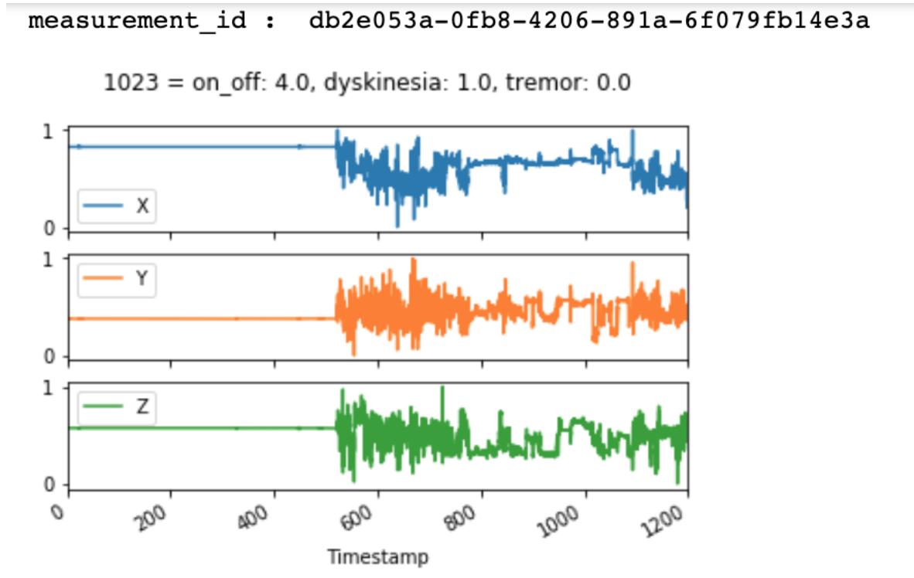
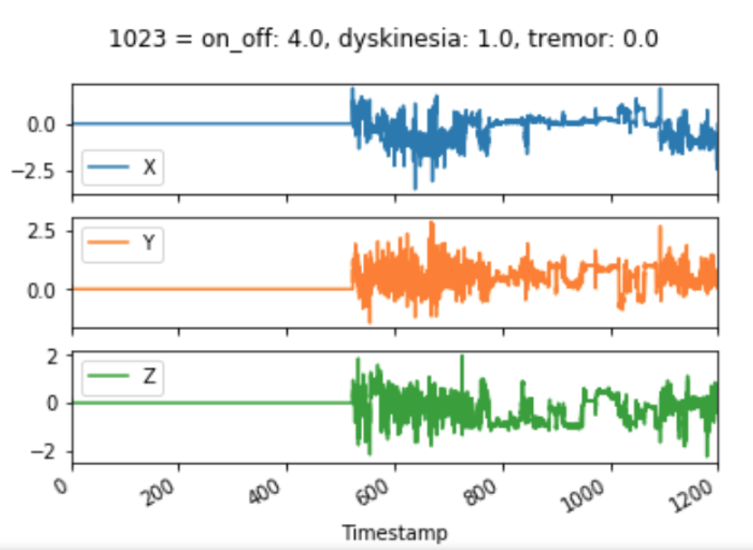
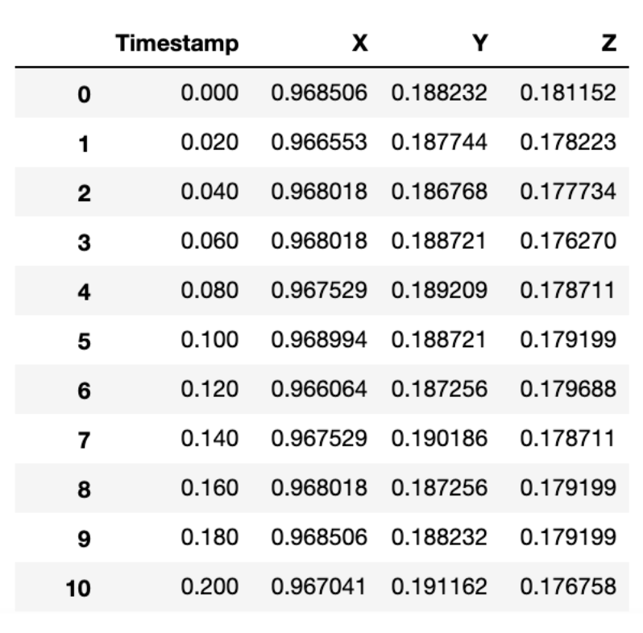
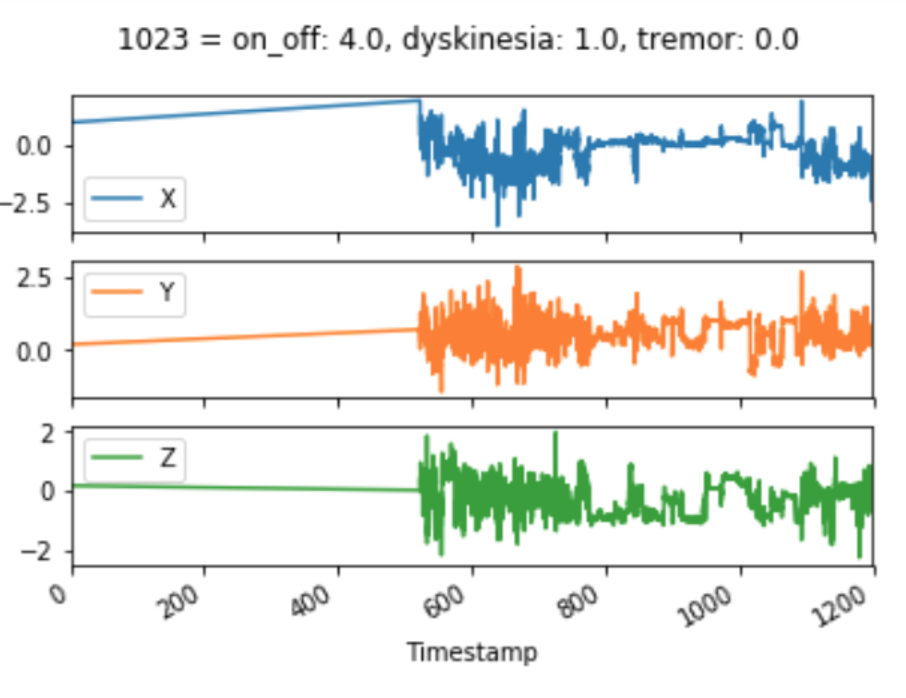

# BEATPD 

## Set up the environment : 
```
$ conda create -n BeatPD python=3.5
$ source activate BeatPD 
$ conda install --file requirements.txt
```

Make sure that the Jupyter notebook is running on `BeatPD` kernel. 

If the conda environment isn't showing in Jupyter kernels (Kernel > Change Kernel > BeatPD), run: 
```
$ ipython kernel install --user --name=BeatPD
```
You will then be able to select `BeatPD` as your kernel. 

## Directory structure 

From `/home/sjoshi/codes/python/BeatPD/data/BeatPD`: 

```
|--cis-pd.ancillary_data : 352 extra files given by the challenge. 
|--cis-pd.ancillary_data.high_pass_mask : Mask with [0,1] of where the high pass filter identified inactivity on ancillary data
|
|--cis-pd.clinical_data : Demographics data about the subjects_id and measurement_id 
|   |
|   |------ CIS-PD_Demographics.csv
|   |------ CIS-PD_UPDRS_Part3.csv
|   |------ CIS-PD_UPDRS_Part1_2_4.csv
|  
|--cis-pd.data_labels
|   |
|   |------ CIS-PD_Ancillary_Data_IDs_Labels.csv
|   |------ CIS-PD_Training_Data_IDs_Labels.csv
|
|
|--cis-pd.training_data : 1858 files - Original training data without any edits
|--cis-pd.training_data.wav_X : Wav files of the training data — the inactivity is NOT removed
|--cis-pd.training_data.wav_Y
|--cis-pd.training_data.wav_Z
|
|--cis-pd.training_data.derivative_original_data : first derivative of accelerometer. High pass filter was also applied so inactivty is removed in these files.  
|
|--cis-pd.training_data.high_pass : Original data where high pass filtered was applied.
|--cis-pd.training_data.high_pass.wav_X : High Pass filtered data to wav files (inactivity is not removed) 
|--cis-pd.training_data.high_pass.wav_Y 
|--cis-pd.training_data.high_pass.wav_Z
|
|--cis-pd.training_data.high_pass_mask : Mask with [0,1] of where the high pass filter identified inactivity 
|--cis-pd.training_data.high_pass_mask.wav_X : Original data where inactivity is removed to wav files 
|--cis-pd.training_data.high_pass_mask.wav_Y 
|--cis-pd.training_data.high_pass_mask.wav_Z
|
|--cis-pd.training_data.k_fold_v1 : Labels divided in 5 folds from which we can read the measurement_id 
|--cis-pd.training_data.k_fold_v2 : Balanced (as much as possible) folds. NaN are replaced with -1 values
|--cis-pd.training_data.k_fold_v3 : Balanced (as much as possible) folds. NaNs are used. 
|
|--cis-pd.training_data.no_silence : Silence removed with pct_change technique 
|
|--cis-pd.testing_data
|
|--real-pd.ancillary_data : Extra data given by the challenge
|--real-pd.ancillary_data.high_pass_mask
|
|--real-pd.clinical_data : Demographics data about the subjects_id and measurement_id 
|--real-pd.data_labels
|   |
|   |------ REAL-PD_Ancillary_Data_IDs_Labels.csv
|   |------ REAL-PD_Training_Data_IDs_Labels.csv
|
|--real-pd.training_data : Original training data without any edits 
|   |
|   |------ smartphone_accelerometer : 526 files
|   |------ smartwatch_accelerometer : 535 files
|   |------ smartwatch_gyroscope : 535 files
|
|--real-pd.training_data.k_fold : Labels divided in 5 folds from which we can read the measurement_id 
|
|-- ubm.dat
|-- gmm.hdf5
```


# Where are the features? 
## MFCC 
`cd /export/c08/lmorove1/kaldi/egs/beatPDivec/*/exp/ivectors_Training_Fold0/ivector.scp`
- `/v1/*/*/ivector.scp`:  on/off using the x axis and 20 mfcc

- `v1_3ax/exp3x/` : on/off using the three axis and 10 mfcc 
- `v1_3ax_10mfcc_dysk/exp3x/` : dysk using the three axis and 10 mfcc
- `v1_3ax_10mfcc_tr/exp3x/`: tremor using the three axis and 10 mfcc

- `v1_autoenc` : on/off using the three axis and autoencoder (30 ft AE) 
- `v1_dysk_auto` : dyskenisia using the three axis and autoencoder (30ft AE)
- `v1_trem_auto` : tremor using the three axis and autoencoder (30ft AE)

## Autoencoder 

On/Off: 
- `on_off_hpf_auto30` : High Pass filtered data. Inactivity is not removed.
- `on_off_noinact_auto30`: Inactivity removed on original training data. 30 fts.
- `on_off_combhpfnoinact_auto30`: High Pass filtered data. Inactivity is removed. 

Tremor: 
- `trem_hpf_auto30` 
- `trem_noinact_auto30`
- `trem_combhpfnoinact_auto30`

Dyskenisia: 
- `dysk_hpf_auto30`
- `dysk_noinact_auto30`
- `dysk_combhpfnoinact_auto30`


# Step-By-Step guide 

### CIS-PD: Create High Pass Data
TODO 

### Create Masks for inactivity removal 
Masks were created in the notebook `analyze_data_cleaned.ipynb`, like so: 
```
remove_inactivity_highpass(
    df_train_label,
    path_train_data,
    data_type,
    energy_threshold=5,
    duration_threshold=3000,
    plot_frequency_response=False,
    mask_path='/home/sjoshi/codes/python/BeatPD/data/BeatPD/cis-pd.'+
    data_subset+'.high_pass_mask/')
```
Two parameters can be tuned:
* `energy_threshold` : what percentage of the max energy do we consider as inactivity? The current masks generated have used the threshold of 5% 
* `duration_threshold` : how long do we want to have inactivity before we remove it? For example 3000x0.02ms=1min of inactivity minimum before those candidates are considered inactivty and will be removed. 

### Create i-vectors 

After creating Autoencoder features, we can create i-vectors. You need to have Kaldi installed first. Follow Kaldi's instructions to install. 

1. `cd /export/c08/lmorove1/kaldi/egs/beatPDivec`
2. `mkdir *****` 
3. `cd ****`
4. `mkdir data`
5. `cp -rf /export/c08/lmorove1/kaldi/egs/beatPDivec/default_data/v2_auto/. ./`
6. `cp -rf /export/c08/lmorove1/kaldi/egs/beatPDivec/default_data/autoencData/****/. data/.` 
Replace "****" with either `on_off`, `trem` or `dysk`
7. `cp ../on_off_noinact_auto60_480fl/run_auto.sh .` I use `on_off_noinact_auto60_480fl/run_auto.sh` only because we made a few changes to the one copied over from step 5 to make it faster on the grid. We also removed KNN and PLDA step as at this time we're focusing on SVR results. 
8. `cp ../on_off_noinact_auto60_400fl/runFor.sh .` Copy a `runFor` from another folder as it's not being copied over from step 5. Be careful that the folder you decide to copy it from as the `local/evaluate SVR` line inside. 
9. In `runFor.sh`, change the `sDirFeats` variable pointing to a folder of AutoEncoder features
10. `screen -R name_of_your_screen`
11. `cd /export/c08/lmorove1/kaldi/egs/beatPDivec/****`
12. `qsub -l mem_free=30G,ram_free=30G -pe smp 6 -cwd -e /export/b19/mpgill/errors/errors_dysk_orig_auto60_400fl -o /export/b19/mpgill/outputs/outputs_dysk_orig_auto60_400fl runFor.sh`

### Evaluation steps 

#### Automatisation to generate the results 

_TODO: To update_

To get all the results for all the combinations of `ivecDim` for every class (`on/off`, `tremor`, `dysk`) for the SVR model, use this script:
1. `./run_SVR_pkl_files.sh` 
2. `./run_all_evaluation_SVR.sh`

#### Manually 
1. To create the pkl files that are going to let you get the challenge final score afterward: 

- `./runSVRFold.sh $sOut $ivecDim $sDirFeats`
- `./runKNNFold.sh $sOut $ivecDim $sDirFeats`
- `./runEveryoneSVRFold.sh ${sOut} $ivecDim $sDirFeats`

Or simply use a script like this to automate the ivectors dimension for a provided folder of features: 

```
echo Working on tremor

#sOut=/export/c08/lmorove1/kaldi/egs/beatPDivec/v1_autoenc/exp/
#sDirFeats=/export/c08/lmorove1/kaldi/egs/beatPDivec/v1_autoenc

sOut=/export/c08/lmorove1/kaldi/egs/beatPDivec/trem_noinact_auto30/exp/
sDirFeats=/export/c08/lmorove1/kaldi/egs/beatPDivec/trem_noinact_auto30

for ivecDim in 50 100 150 200 250 300 350 400 450 500 550; do
    echo Working on ${ivecDim}
    ./runKNNFold.sh ${sOut} $ivecDim $sDirFeats
done
```
Many examples are available on the repository in the folder `run_SVR/`. 

2. If pickle files are already created and you just want to get the final score as used in the challenge (weighted MSE): 

#### For KNN 

- `./evaluate_global_acc_knn.sh /export/c08/lmorove1/kaldi/egs/beatPDivec/trem_noinact_auto30/exp/ivec_350/ /export/c08/lmorove1/kaldi/egs/beatPDivec/trem_noinact_auto30/exp/ivec_350/`

To get a final score for KNN, only add the `--is-knn` flag, like so: 

```
$cmd $sOut/globalAccuKNN_Test.log \
     ${filePath}get_final_scores_accuracy.py  --file-path $sFileTrai \
     --is-knn
```

#### For SVR 

- `./evaluate_global_SVR.sh /export/c08/lmorove1/kaldi/egs/beatPDivec/v1_autoenc/exp/ivec_50/ /export/c08/lmorove1/kaldi/egs/beatPDivec/v1_autoenc/exp/ivec_50/`

_FIXME: Is it really that sh file?_ 

This script will generate a `.log` file from the name and location provided in `evaluate_global_acc.sh`, like so:

```
$cmd $sOut/globalAccuSVR_Test.log \
     ${filePath}get_final_scores_accuracy.py  --file-path $sFileTrai \
     --is-svr
```

The result will be stored in `/export/c08/lmorove1/kaldi/egs/beatPDivec/v1_autoenc/exp/ivec_50/globalAccuSVR_Test.log`

#### For SVR Per Patient 

##### Option 1 (the best one)

Use the `runFor.sh` file in the repository. For example:

`cd /export/c08/lmorove1/kaldi/egs/beatPDivec/dysk_noinact_auto30/`

If you don't need to run the extractions of ivectors and other stuff, make sure to comment some code in the `runFor.sh` file before running it. 

`qsub -l mem_free=30G,ram_free=30G -pe smp 6 -cwd -e /export/b19/mpgill/errors/errors_dysk_noinact_auto30 -o /export/b19/mpgill/outputs/outputs_dysk_noinact_auto30 runFor.sh`

##### Option 2 (in your own repo, on a specific branch for example)

For this type of results, pkl files are the same as the one for regular SVR. When `.pkl` files are present in `resiVecSVR_Fold*` folders, than you can find the best set of hyperparameters with a function in the file `get_final_scores_accuracy.py` and get a final score. 

You need to edit the file `run_evaluate_global_per_patient_SVR.sh` and write manually the name of the folder with the ivectors you want to get results for, as well as for what dimensions of ivectors as it will loop over all the ivector dimensions given. 

Here's a command as an example: 

```
qsub -l mem_free=30G,ram_free=30G -pe smp 6 -cwd -e /export/b19/mpgill/errors/error_file -o /export/b19/mpgill/outputs/output_file run_evaluate_global_per_patient_SVR.sh
```

The file `run_evaluate_global_per_patient_SVR.sh` actually calls the file `evaluate_global_per_patient_SVR.sh` that creates the log files with the results we are looking for : `/export/c08/lmorove1/kaldi/egs/beatPDivec/***/exp/ivec_***/globalAccuPerPatientSVR_Test.log`

##### Option 3 (very manual)

If you only want to have results for one ivector dimension, you can do this directly like this: 

`./evaluate_global_per_patient_SVR_patient_SVR.sh /export/c08/lmorove1/kaldi/egs/beatPDivec/v1_autoenc/exp/ivec_50/ /export/c08/lmorove1/kaldi/egs/beatPDivec/v1_autoenc/exp/ivec_50/` 

#### For SVR Everyone 

##### Option 1 (the best one)

To create `.pkl` files for SVR Everyone, `stage=6` needs to be ran. 

`cd /export/c08/lmorove1/kaldi/egs/beatPDivec/v1_autoenc/exp/ivec_50/`

`vim runFor.sh` : Edit this file to run stage 6. You can comment the part that extracts ivectors if that's already done. 

Make sure `local/evaluate_global_everyone_SVR.sh` is ran also following the `run_auto.sh` stage 6 to create the log files with results. 

##### Option 3 

To get results: 
`./evaluate_global_everyone_SVR.sh /export/c08/lmorove1/kaldi/egs/beatPDivec/v1_autoenc/exp/ivec_50/ /export/c08/lmorove1/kaldi/egs/beatPDivec/v1_autoenc/exp/ivec_50/`

### Automation to get results directly to Excel format 

As of now, the automation is present in the `drafts.ipynb`, and just creates a table in Jupyter from which we can copy and paste to Excel or Google spreadsheet: 

```
import pandas as pd 
import re


#/export/c08/lmorove1/kaldi/egs/beatPDivec/trem_noinact_auto30/exp/ivec_350/
#trem_noinact_auto30
for folder in ['trem_noinact_auto60_480fl']:#'trem_noinact_auto30']:#,'trem_noinact_auto30_320fl','trem_noinact_auto30_240fl','trem_noinact_auto60_400fl']:
    print(folder)
    value = []
    liVecDim = [350,400,450,500, 550]
    for ivecDim in liVecDim:
        sFilePath='/export/c08/lmorove1/kaldi/egs/beatPDivec/'+folder+'/exp/ivec_'+str(ivecDim)+'/'

        config_pattern = re.compile(r"Test Final score\s:\s*(\d*.\d*)")

        with open(sFilePath+"globalAccuPerPatientSVR_Test.log") as f:
            for line in f:
                match = config_pattern.search(line)
                if match:
                    #print(match.groups()[0])
                    value.append(match.groups()[0])
                    #yield line.strip()

    value = pd.DataFrame(value)
    value = value.T
    value.columns = liVecDim
    display(value)
```


# Inactivity (apply high-pass filter) 

## Example of what it does with plots 

Here's an example for measurement_id `db2e053a-0fb8-4206-891a-6f079fb14e3a` from the CIS-PD database.



After the High pass filter (inactivity identified is filled with X,Y,Z=0 for the purpose of the plot) :



It looks good, with a straight line of inactivity on “zero”… However, it’s not  visible to the eyes, but there are some values left at the complete beginning of the dataframe from index 0 to index 31. 

Then we have inactivity from index 32 to 26073.



This explains why the accelerometer with inactivity removed looks like this: 

We have 32 values right at the beginning which prevents the graph to show just the [600,1200] part



## How to remove inactivity

Masks have already been created detecting inactivity for all the databases. They are stored in the `*.high_pass_mask` folder. 


What's left is to apply the mask. To do so, a function called `apply_mask` located in `transform_data.py` can be used. 

```
# import transform_data
from transform_data import apply_mask

# path_train_data : path to the original training files which we want to apply the highpass filter on 
# measurement_id : measurement_id we want to apply the mask to
# mask_path: Path where to apply the mask to the wav file 

df_train_data = apply_mask(path_train_data,
                                   measurement_id,
                                   mask_path)
```

# Working in Jupyter Notebooks 

## Import functions 

If you're working in Jupyter notebooks, you will probably need to import functions from python files. 

You should use these two lines to make sure that if you make changes to the python files, the code that is being called from your Jupyter Notebook will be updated: 

```
%load_ext autoreload
%autoreload 2

from transform_data import *
from create_graphs import *
```

## Opening Jupyter notebooks on the grid - example 

1. `ssh -L 8805:b19:8805 -J mpgill@login.clsp.jhu.edu mpgill@b19`
2. `screen -R marie-jup`
3. `cd /home/sjoshi/codes/python/BeatPD`
4. `jupyter-notebook --no-browser --port 8805`
