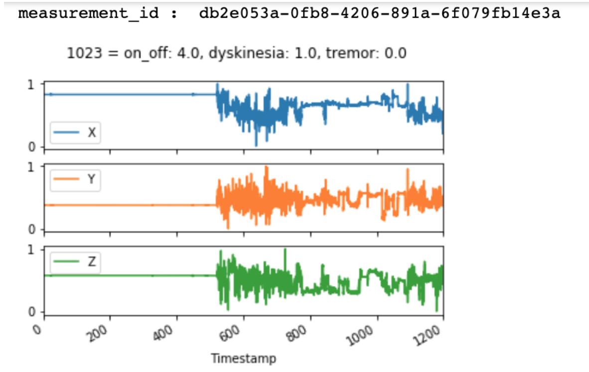
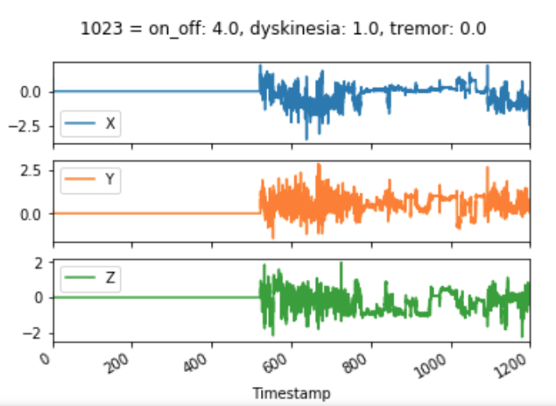
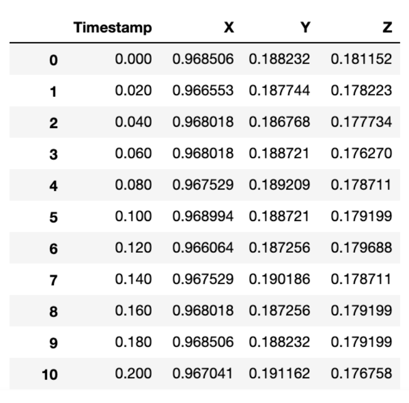
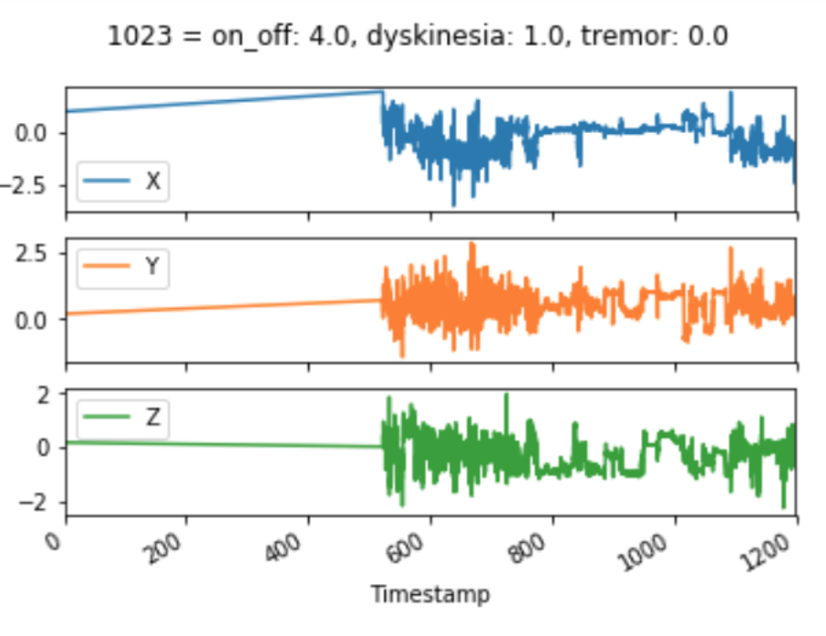

# BEATPD 

## Set up the environment : 
```
$ conda create -n BeatPD python=3.5
$ source activate BeatPD 
$ conda install --file requirements.txt
```

Make sure that the Jupyter notebook is running on `BeatPD` kernel. 

If the conda environment isn't showing in Jupyter kernels (Kernel > Change Kernel > BeatPD), run: 
```
$ ipython kernel install --user --name=BeatPD
```
You will then be able to select `BeatPD` as your kernel. 

## Directory structure 

```
|--cis-pd.ancillary_data : 352 extra files given by the challenge. 
|--cis-pd.ancillary_data.high_pass_mask : Mask with [0,1] of where the high pass filter identified inactivity on ancillary data
|
|--cis-pd.clinical_data : Demographics data about the subjects_id and measurement_id 
|   |
|   |------ CIS-PD_Demographics.csv
|   |------ CIS-PD_UPDRS_Part3.csv
|   |------ CIS-PD_UPDRS_Part1_2_4.csv
|  
|--cis-pd.data_labels
|   |
|   |------ CIS-PD_Ancillary_Data_IDs_Labels.csv
|   |------ CIS-PD_Training_Data_IDs_Labels.csv
|
|
|--cis-pd.training_data : 1858 files - Original training data without any edits 
|--cis-pd.training_data.high_pass_mask : Mask with [0,1] of where the high pass filter identified inactivity 
|--cis-pd.training_data.k_fold : Labels divided in 5 folds from which we can read the measurement_id 
|--cis-pd.training_data.no_silence : Silence removed with pct_change technique 
|--cis-pd.training_data.velocity_original_data : Training data where we found velocity with first derivative of accelerometer.
|   High pass filter was also applied so inactivty is removed in these files. 
|
|--cis-pd.testing_data
|
|--real-pd.ancillary_data : Extra data given by the challenge
|--real-pd.ancillary_data.high_pass_mask
|
|--real-pd.clinical_data : Demographics data about the subjects_id and measurement_id 
|--real-pd.data_labels
|   |
|   |------ REAL-PD_Ancillary_Data_IDs_Labels.csv
|   |------ REAL-PD_Training_Data_IDs_Labels.csv
|
|--real-pd.training_data : Original training data without any edits 
|   |
|   |------ smartphone_accelerometer : 526 files
|   |------ smartwatch_accelerometer : 535 files
|   |------ smartwatch_gyroscope : 535 files
|
|--real-pd.training_data.k_fold : Labels divided in 5 folds from which we can read the measurement_id 
|
|-- ubm.dat
|-- gmm.hdf5
```

# Databases

<table class="tg">
  <tr>
    <th class="tg-0pky"></th>
    <th class="tg-0pky">CIS-PD</th>
    <th class="tg-0pky">REAL-PD</th>
  </tr>
  <tr>
    <td class="tg-0pky"># of subject_id training</td>
    <td class="tg-c3ow">16</td>
    <td class="tg-c3ow">12</td>
  </tr>
  <tr>
    <td class="tg-0pky"># of female training</td>
    <td class="tg-c3ow">5</td>
    <td class="tg-c3ow">7</td>
  </tr>
  <tr>
    <td class="tg-0pky"># of male training</td>
    <td class="tg-c3ow">11</td>
    <td class="tg-c3ow">5</td>
  </tr>
  <tr>
    <td class="tg-0pky">Age average (std deviation)</td>
    <td class="tg-c3ow">62.8125 (10.857)</td>
    <td class="tg-c3ow">59.833 (5.828)</td>
  </tr>
</table>


# I-vector training 

Documentation: 
- https://groups.google.com/forum/#!msg/bob-devel/ztz2TcTDH_Y/ISjzx6L1BQAJ
- https://www.idiap.ch/software/bob/docs/bob/bob.learn.em/stable/guide.html#id29
- https://www.idiap.ch/software/bob/docs/bob/bob.learn.em/stable/guide.html#session-variability-modeling-with-gaussian-mixture-models
- https://groups.google.com/forum/#!topic/bob-devel/lFda64dmpjY


### Steps used to setup the bob_py3 conda environment

```
$ conda create --name bob_py3 --override-channels -c https://www.idiap.ch/software/bob/conda -c defaults bob
$ conda activate bob_py3
$ conda config --env --add channels https://www.idiap.ch/software/bob/conda/label/archive
$ conda config --env --add channels defaults
$ conda config --env --add channels https://www.idiap.ch/software/bob/conda
$ conda install bob.bio.gmm
$ conda install nb_conda_kernels
```


Questions: 
- Which one to use `bob.learn.em.IVectorTrainer` or the one in `bob.bio.gmm.algorithm.IVector`?
    - it depends. When you want to implement your own application for i-vector training and evaluation, the bob.learn.em classes should work for you. When you are implementing speaker recognition experiments, bob.bio.gmm is the better choice.
    
 We chose to use `bob.learn.em.IVectorTrainer` as advised by a maintainer of bob.

### Where are the features? 
`/export/c08/lmorove1/kaldi/egs/beatPDivec/*//exp/ivectors_Training_Fold0/ivector.scp`
- `/v1/*/*/ivector.scp`:  on/off using the x axis and mfcc
- `v1_3ax` : on/off using 3 axis and mfcc 
- `v1_3ax_10mfcc_dysk`
- `v1_3ax_10mfcc_tr`
- `v1_autoenc` : on/off using the three axis and autoencoder (30 ft AE)
- `v1_dysk_auto` : dyskenisia using the three axis and autoencoder (30ft AE)
- `/v1_trem_auto/` : tremor using the three axis and autoencoder (30ft AE)

- `/export/c08/lmorove1/kaldi/egs/beatPDivec/v1_3ax_10mfcc_tr/exp`: tremor using the three axis and 10 mfcc 


### Step-By-Step guide 

To create the pkl files that are going to let you get the challenge final score afterward: 

This file contains a variable `ivecDim=50` which hardcode the ivector size you want to use. We need to change the value manually to generate the files for all the different ivectors sizes. 
 
`./runSVRFold.sh /export/c08/lmorove1/kaldi/egs/beatPDivec/v1_autoenc/exp/`
`./runKNNFold.sh /export/c08/lmorove1/kaldi/egs/beatPDivec/v1_autoenc/exp/`

To get the final score as used in the challenge: 
`./evaluate_global_acc.sh /export/c08/lmorove1/kaldi/egs/beatPDivec/v1_autoenc/exp/ivec_50/ /export/c08/lmorove1/kaldi/egs/beatPDivec/v1_autoenc/exp/ivec_50/`

This script will generate a .log file from the name and location provided in `evaluate_global_acc.sh`. 

For example, for SVR: 
```
./evaluate_global_acc.sh /export/c08/lmorove1/kaldi/egs/beatPDivec/v1_autoenc/exp/ivec_50/ /export/c08/lmorove1/kaldi/egs/beatPDivec/v1_autoenc/exp/ivec_50/
```
With this content: 
```
$cmd $sOut/globalAccuSVR_Test.log \
     ${filePath}get_final_scores_accuracy.py  --file-path $sFileTrai \
     --is-svr
```
The result will be stored in `/export/c08/lmorove1/kaldi/egs/beatPDivec/v1_autoenc/exp/ivec_50/globalAccuSVR_Test.log`

To get a final score for KNN, only add the `--is-knn` flag, like so: 

```
$cmd $sOut/globalAccuSVR_Test.log \
     ${filePath}get_final_scores_accuracy.py  --file-path $sFileTrai \
     --is-knn
```

# Inactivity (apply high-pass filter) 

## Example of what it does with plots 

Here's an example for measurement_id `db2e053a-0fb8-4206-891a-6f079fb14e3a` from the CIS-PD database.




After the High pass filter (inactivity identified is filled with X,Y,Z=0 for the purpose of the plot) :



It looks good, with a straight line of inactivity on “zero”… However, it’s not  visible to the eyes, but there are some values left at the complete beginning of the dataframe from index 0 to index 31. 

Then we have inactivity from index 32 to 26073.



This explains why the accelerometer with inactivity removed looks like this: 

We have 32 values right at the beginning which prevents the graph to show just the [600,1200] part



## How to remove inactivity

Masks have already been created detecting inactivity for all the databases. They are stored in the `*.high_pass_mask` folder. 

Masks were created in the notebook `analyze_data_cleaned.ipynb`, like so: 
```
remove_inactivity_highpass(
    df_train_label,
    path_train_data,
    data_type,
    energy_threshold=5,
    duration_threshold=3000,
    plot_frequency_response=False,
    mask_path='/home/sjoshi/codes/python/BeatPD/data/BeatPD/cis-pd.'+
    data_subset+'.high_pass_mask/')
```
Two parameters can be tuned:
* `energy_threshold` : what percentage of the max energy do we consider as inactivity? The current masks generated have used the threshold of 5% 
* `duration_threshold` : how long do we want to have inactivity before we remove it? For example 3000x0.02ms=1min of inactivity minimum before those candidates are considered inactivty and will be removed. 


What's left is to apply the mask. To do so, a function called `apply_mask` located in `transform_data.py` can be used. 

```
# import transform_data
from transform_data import apply_mask

# path_train_data : path to the original training files which we want to apply the highpass filter on 
# measurement_id : measurement_id we want to apply the mask to
# mask_path: Path where to apply the mask to the wav file 

df_train_data = apply_mask(path_train_data,
                                   measurement_id,
                                   mask_path)
```

# Working in Jupyter Notebooks 

If you're working in Jupyter notebooks, you will probably need to import functions from python files. 

You should use these two lines to make sure that if you make changes to the python files, the code that is being called from your Jupyter Notebook will be updated: 

```
%load_ext autoreload
%autoreload 2

from transform_data import *
from create_graphs import *
```

